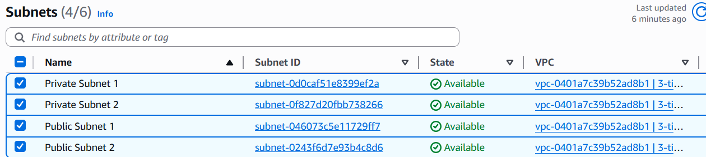
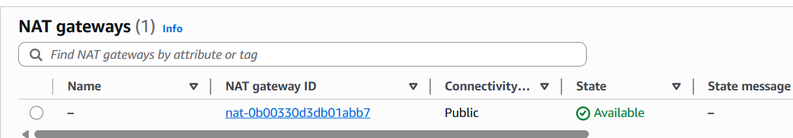
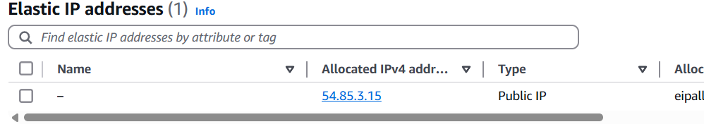

# aws-terraform-3tier-app

- Implementing an AWS project with terraform 


## Table of contents

- [aws-terraform-3tier-app](#aws-terraform-3tier-app)
  - [Table of contents](#table-of-contents)
  - [Architecture View](#architecture-view)
  - [Prerequisites](#prerequisites)
  - [Configure AWS Creds](#configure-aws-creds)
  - [Terraform Commands](#terraform-commands)
- [Modules](./modules/)

    
## Architecture View


## Prerequisites

- Terraform 
- AWS CLI 
- Git 
- Docker 

### Configure AWS Creds

1. Download AWS Access Keys from `IAM` Service, Go to Security Credentials and Find "Access keys" and click "Create Access key".
2. Run Command:
```bash
  aws configure
```
3. Add the required information AWS Access Key ID AWS Secret Access Key Default region name `us-east-1` Default output format `JSON`.

### Terraform Commands 

- Run `terraform init` to initialize the provider.
- Run `terraform plan` to Generates and shows the execution plan.
- Run `terrafrom apply -auto-approve` to Apply the changes to reach the desired infrastructure state.

### Verify Setup 

- VPC Subnets



- NAT Gateway and Elastic IP


